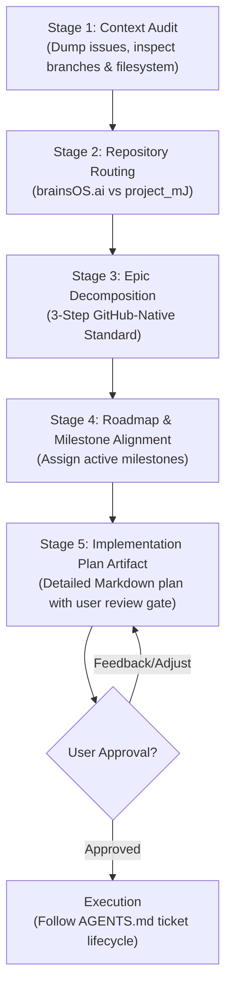

# brainsOS: Strategic Planning & Epic Management Protocol (`PLANNING.md`)

This document defines the mandatory planning protocol for AI agents and human developers across **brainsOS.ai** ([brainsOS.ai](https://brainsos.ai)) and the private fleet repository (**project_mJ**). 

While [`AGENTS.md`](AGENTS.md) governs the **execution lifecycle** of individual tickets (branching, testing, walkthroughs, pre-commit review gates), this document governs the **strategic lifecycle**—how we ideate, decompose epics, route between repositories, manage milestones, and maintain backlog hygiene.

---

## 0. The Division of Discipline

| Concern | Authoritative Document | Focus Area |
| :--- | :--- | :--- |
| **Execution Discipline** | [`AGENTS.md`](AGENTS.md) | Branching policy, script-first validation, walkthrough documents, pre-commit review gates, code quality, and operational safety guardrails. |
| **Strategic Planning Discipline** | [`PLANNING.md`](PLANNING.md) | Architectural roadmap, backlog pruning, two-repository routing, 3-step GitHub-native Epics, and milestone management. |

---

## 1. The Planning Session Lifecycle (`/plan`)

Every major architecture shift, multi-ticket initiative, or backlog cleanup begins with a formal planning session triggered by the user (typically via `/plan`). 

AI agents executing a planning session must follow this 5-stage lifecycle:



### Stage 1: Context Audit & State Discovery
Before proposing plans or modifying issues:
1. **Dump Issue Inventory**: Fetch all open and closed issues using `gh issue list --json` to analyze the complete state.
2. **Inspect Codebase Parity**: Review active branches (`git branch -a`), uncommitted work (`git status`), and current container topologies.
3. **Never Plan in a Vacuum**: Always verify existing capabilities against active code rather than assuming historical issues reflect current reality.

### Stage 2: Two-Repository Routing
Before creating issues or drafting architecture, route every concept to its canonical repository:
- **`patternsatscale/brainsOS.ai`** (Open-Source Platform Core):
  - Container topologies (`docker-compose.yml`, `infra/`).
  - Ingress, proxy routing, and authentication (`config/caddy/`, Dashy, Authentik).
  - Control plane LiteLLM gateway (`config/litellm/`).
  - Core stateless agent runners and queue engines (`packages/brainsOS-*`).
  - COHUMAIN ACSG / AGSC governance frameworks and public attestations (`audit.md`).
- **`patternsatscale/project-mJ`** (Private Fleet IP & Thermodynamic Lab):
  - Proprietary agent personas and identity files (`souls/`).
  - Agent-authored web applications and codebases (`agent_apps/`, `agent_workspaces/`).
  - Open Knowledge Format (OKF) memory partitions (`agent_memories/`).
  - Project Millijoule thermodynamic telemetry, Stella 50 EM energy meter logging, and microgrid solar orchestration.
  - Experimental lab documentation, slide decks, and persona critiques (`docs/lab-work/`).

### Stage 3: The 3-Step GitHub-Native Epic Standard
All multi-ticket initiatives must strictly adhere to the 3-step Epic standard detailed in §2.

### Stage 4: Milestone & Roadmap Alignment
Assign every new issue and epic to an active milestone. Never leave issues floating in a "No Milestone" state.

### Stage 5: Implementation Plan Artifact
Draft a detailed plan artifact (`<plan_name>.md`) with:
- Summary of proposed changes.
- Mermaid diagrams for architectural shifts.
- Detailed task breakdown table.
- Verification plan.
- Explicit human review gate.

---

## 2. The 3-Step GitHub-Native Epic Standard

To maintain clean project tracking without requiring third-party plugins (ZenHub, Jira), we leverage GitHub's native task lists and project features:

### Step 1: The `epic` Label
Every parent container issue receives the dedicated label:
- **Name**: `epic`
- **Color**: `#3E1C87` (Dark Purple)
- **Description**: `Overarching feature container tracking sub-tasks`

### Step 2: Parent Issue with Native GFM Task Lists
Create a parent GitHub Issue to act as the Epic. In its description, list child tasks using standard GitHub Flavored Markdown (GFM) checklist syntax referencing issue numbers:

```markdown
## 1. Overview
High-level architectural objective and business rationale.

## 2. Child Deliverables & Native Task List
- [ ] #101 [Component / Area] Concise Child Task 1 Title
- [ ] #102 [Component / Area] Concise Child Task 2 Title
- [ ] #103 [Component / Area] Concise Child Task 3 Title

## 3. Operational Guardrails
Constraints, boundary protections, and verification requirements.
```

**Why this is mandatory**:
- GitHub natively parses `- [ ] #<number>` and renders an interactive **progress bar** (`X of Y tasks completed`) at the header of the Epic.
- Child issues automatically render bidirectional backlinks to the parent Epic.
- When a child PR merges and closes the child issue, the checkbox in the parent Epic automatically checks off.

### Step 3: GitHub Projects (v2) Integration
On the repository or organization GitHub Projects board:
1. Create a custom field named **`Parent Epic`** (Single-Select or Text).
2. Configure board views to **Group by: `Parent Epic`** to generate clean horizontal Kanban swimlanes.
3. Use the **Roadmap (Gantt) view** mapped to Milestones to track start and target completion dates.

---

## 3. Atomic Scoping & Epic Sizing Heuristics

To prevent bloated, unmaintainable "mega-epics", agents and developers must observe strict sizing boundaries:

1. **The Rule of 3–5 Tasks per Epic**:
   - An Epic should contain between **3 and 6 child tasks**.
   - If an initiative requires more than 6 distinct components, it is a multi-epic program and must be split into separate focused Epics.
   - *Example*: Rather than a monolithic "Cindy Pawford Full Automation" Epic, split into:
     - `[Epic] Cindy Pawford: Autonomous Publishing Pipeline & Promotion Circuit Breakers`
     - `[Epic] Cindy Pawford: Autonomous Comic Strip Generation`
2. **Atomic Child Tasks**:
   - Each child task must represent **one single verifiable deliverable** (typically 1–2 days of engineering).
   - If a task requires more than 3–4 distinct system modifications, break it down further.
3. **No Mixed-Plane Tasks**:
   - Do not combine infrastructure/Docker provisioning with agent prompt engineering or frontend styling in a single child task. Split them by architectural plane.

---

## 4. Backlog Hygiene & Issue Pruning Protocol

Unmanaged issue trackers accumulate technical debt and hallucinated requirements. We enforce proactive backlog hygiene:

### 1. Milestone Auditing
- Maintain a small set of focused, active milestones (e.g. `MVP v0.1`, `v0.2 Security`, `v0.3 Governance`, `Backlog / Future Research`).
- **Zero Unassigned Issues**: Every open issue must be assigned to an active milestone.
- When all issues in a milestone are completed, close the milestone immediately.

### 2. Pruning & Stale Issue Retirement
During planning sessions, aggressively prune the backlog:
- **Superseded Tickets**: If an architectural evolution replaces an older design (e.g. Dashy + Authentik replacing custom iframe shells), close the obsolete tickets immediately.
- **Micro-PR Tickets**: If granular sub-tickets from legacy plans clutter the backlog, consolidate or close them.
- **Mandatory Audit Trail**: When closing issues without implementation, **always post a closing comment** explaining:
  1. The architectural rationale for closure.
  2. The modern ticket, epic, or repository that supersedes it.
  3. Close with reason `not planned` (or `completed` if previously satisfied by an unlinked PR).

### 3. Tangential Discovery Discipline
If an agent discovers an unexpected bug or enhancement while working on a ticket:
- **Never expand the current ticket's scope**.
- File a new GitHub Issue assigned to the appropriate milestone.
- If it relates to an active Epic, add it to the parent Epic's GFM task checklist.

---

## 5. Initiating a Planning Conversation (Quick Reference)

When starting a strategic discussion or roadmap refinement, prompt the agent with:

```text
/plan Let's review our active milestones and plan the next Epic for [feature/initiative] according to PLANNING.md.
```

The agent will automatically:
1. Audit existing issues and code parity.
2. Route components to `brainsOS.ai` or `project_mJ`.
3. Propose decomposed Epics following the 3-step standard.
4. Provide a structured plan artifact for human approval before creating issues.
