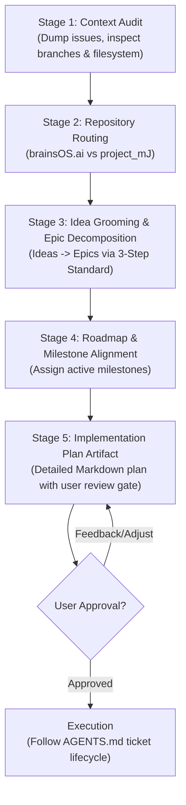

# brainsOS: Strategic Planning & Epic Management Protocol (`PLANNING.md`)

This document defines the mandatory planning protocol for AI agents and human developers across **brainsOS.ai** ([brainsOS.ai](https://brainsos.ai)) and the private fleet repository (**project_mJ**). 

While [`AGENTS.md`](AGENTS.md) governs the **execution lifecycle** of individual tickets (branching, testing, walkthroughs, pre-commit review gates), this document governs the **strategic lifecycle**—how we ideate, decompose epics, route between repositories, manage milestones, and maintain backlog hygiene.

---

## 0. The Division of Discipline & The Product Hierarchy

### The Division of Discipline
| Concern | Authoritative Document | Focus Area |
| :--- | :--- | :--- |
| **Execution Discipline** | [`AGENTS.md`](AGENTS.md) | Branching policy, script-first validation, walkthrough documents, pre-commit review gates, code quality, and operational safety guardrails. |
| **Strategic Planning Discipline** | [`PLANNING.md`](PLANNING.md) | Architectural roadmap, backlog pruning, two-repository routing, 3-step GitHub-native Epics, and milestone management. |

### The Core Taxonomy: Ideas, Epics, Features, and Tickets

To eliminate ambiguity across agile planning and GitHub issue tracking, we define distinct roles for each concept:

| Level | Concept | What It Represents | GitHub Primitive | Label & Milestone | Governed By |
| :--- | :--- | :--- | :--- | :--- | :--- |
| **Level 1** | **💡 Idea** | **The Spark.** An exploratory hypothesis or feature suggestion. Low-friction capture, unvetted, no strict specs. | GitHub Issue | `idea` in `Backlog / Future Research` | [`PLANNING.md`](PLANNING.md) §1 |
| **Level 2** | **📦 Epic** | **The Container.** A multi-day initiative too large for one PR (1–3 weeks, touches multiple planes). **Never coded directly**. | Parent GitHub Issue with GFM checklist (`- [ ] #101`) | `epic` in Target Active Milestone | [`PLANNING.md`](PLANNING.md) §4 |
| **Level 3** | **🎯 Feature** | **The Capability.** A cohesive unit of functional capability delivered to an operator or agent. | GitHub Issue | `type:feat` in Active Milestone | [`AGENTS.md`](AGENTS.md) |
| **Level 4** | **🔨 Ticket / Task** | **The Work Order.** The atomic unit of engineering that **one agent/developer builds in one branch and one PR** (1–2 days max). | Numbered GitHub Issue (`#246`) | `type:feat`, `type:infra`, `type:security`, `type:task` | [`AGENTS.md`](AGENTS.md) |
| **Defect** | **🐛 Bug** | **The Flaw.** Broken invariant, crash, or test failure in existing code. Bypasses the Idea/Epic pipeline. | GitHub Issue | `bug` in `Bugs / Defects` | [`PLANNING.md`](PLANNING.md) §2 |

### Do Features Always Align to Epics?
**No. Epics and Features are different concepts:**
- **An Epic is a Container**. It exists *only* when an initiative is too large for a single pull request and requires multi-step coordination across planes (e.g. portal UI + OAuth proxy + container networks).
- **A Feature is a Functional Capability**. It is *what* the software does for the user or agent.

**The Sizing Rule**:
1. **Multi-Component Features (> 2 days of engineering)**: Become an **Epic** (`epic`), decomposed into 3–5 child tickets (some `type:feat`, some `type:infra`, some `type:security`, some `type:task`).
2. **Standalone Features (≤ 2 days of engineering)**: Stand alone as a direct **Ticket** (`type:feat`) assigned to an active milestone. **Never create a 1-to-1 "single child" Epic**—forcing an Epic container for a 1-day feature is unnecessary overhead.

### Standardized Issue Title Formatting
Every issue title must strictly adhere to the bracketed prefix standard for instant scannability:
- **Epics**: `[Epic] <Concise Title>` *(e.g. `[Epic] BrainsOS System View & Fleet Operations Dashboard`)*
- **Ideas**: `[Idea] <Exploratory Title>` *(e.g. `[Idea] AWS Cloud Deployment Topology & SST Infrastructure`)*
- **Bugs**: `[Bug / <Domain>] <Defect Remediation Title>` *(e.g. `[Bug / Security] Remediate Live Process UID Checks in Verification Scripts`)*
- **Tickets (Features & Tasks)**: `[<Domain> / <Sub-domain>] <Action-Oriented Title>` *(e.g. `[System View / API] System Telemetry & Fleet Control API Daemon`)*

---

## 1. The Idea Registry Protocol (`💡 Ideas`)

To prevent innovative concepts from being lost while avoiding premature over-engineering, we maintain a lightweight **Idea Registry** in GitHub Issues:

### 1. Capturing an Idea (Low-Friction)
Anyone (developer, user, or agent) can register an idea without writing detailed acceptance criteria:
- **Label**: Add the `idea` label.
- **Milestone**: Assign to `Backlog / Future Research`.
- **Lightweight Structure**:
  ```markdown
  ## 💡 Concept & Inspiration
  Brief explanation of the problem, spark, or opportunity.

  ## 🧭 Rough Shape & Hypothesis
  High-level direction or proposed approach (bullet points, not full specs).

  ## 🔍 Potential Touchpoints
  Planes, packages, or containers likely affected (e.g. LiteLLM, Caddy, Hermes, memories).

  ## 🚀 Triggers for Promotion
  What conditions, user needs, or dependencies would justify promoting this to an active Epic?
  ```

### 2. The Promotion Flow (`Ideas` ➔ `Epics`)
During a planning session (`/plan`):
1. **Filter & Select**: Review open issues labeled `idea` in `Backlog / Future Research`.
2. **Sizing & Scoping**:
   - **Multi-component / Complex**: Promote to an **Epic** per §4, decomposing into 3–5 atomic child sub-issues.
   - **Single Atomic Task**: If the idea is actually a small, discrete 1-day fix or tweak, convert it directly to an atomic task issue (`type:feat` or `type:task`) and assign to an active milestone.
3. **Traceability & Retirement**:
   - In the new Epic's description, explicitly reference the origin: `Promoted from Idea #<id>`.
   - Close the originating Idea issue as `completed` with an explanatory comment:
     ```markdown
     > 💡 **Idea Promoted**: Promoted to Epic #<epic_number> (<epic_title>). 
     > Tracking execution under active milestone '<milestone_name>'.
     ```
   - This keeps `Backlog / Future Research` clean while preserving an immutable historical audit trail.

---

## 2. The Bug & Defect Protocol (`🐛 Bugs / Defects`)

To maintain high code quality and isolate functional regressions from forward-looking roadmap feature work, all unexpected defects, runtime crashes, and assertion failures must be cataloged in a dedicated milestone:

### 1. Bug Intake & Triage
Whenever a bug or regression is discovered (during local development, CI runs, production appliance operations, or while executing another ticket per [`AGENTS.md`](AGENTS.md)):
- **Label**: Add the `bug` label (`#d73a4a`).
- **Milestone**: Assign to **`Bugs / Defects`**.
- **Structured Bug Report Format**:
  ```markdown
  ## 🐛 Defect Overview
  Concise summary of the broken behavior vs. expected behavior.

  ## 🔁 Steps to Reproduce
  1. Exact command or interaction sequence...
  2. Observed output or failure log.

  ## 🔍 Suspected Root Cause & Files
  Candidate scripts, configs, or package files involved (e.g. `scripts/verify/verify-fleet.sh`, `packages/brainsOS-agent/`).

  ## ✅ Acceptance Criteria & Regression Assertion
  - [ ] Fix the defect in target code/scripts.
  - [ ] Add an automated regression assertion in `pytest` or `scripts/verify/*.sh` asserting the fix.
  ```

### 2. Bug Resolution & Promotion Lifecycle
- **Critical / Blocker Bugs (P0)**: If a bug blocks core appliance startup, crashes the LiteLLM control plane, breaches security sandboxes (Rule 4), or corrupts memory plane purity (Rule 1), fast-track it immediately into the active milestone (e.g. `MVP v0.1`) or hotfix via `task/<id>-fix-<desc>` following [`AGENTS.md`](AGENTS.md).
- **Non-Blocking Defects**: Remain organized under `Bugs / Defects` until prioritized into an active sprint or hardening milestone (e.g. `v0.2 — Security & Sandboxing Hardening`).
- **Mandatory Regression Gate**: A bug ticket may **never** be closed without a passing regression test or verification script proving the issue cannot recur.

---

## 3. The Planning Session Lifecycle (`/plan`)

Every major architecture shift, multi-ticket initiative, or backlog cleanup begins with a formal planning session triggered by the user (typically via `/plan`). 

AI agents executing a planning session must follow this 5-stage lifecycle:



### Stage 1: Context Audit & State Discovery
Before proposing plans or modifying issues:
1. **Dump Issue Inventory**: Fetch all open and closed issues using `gh issue list --json` to analyze the complete state.
2. **Inspect Codebase Parity**: Review active branches (`git branch -a`), uncommitted work (`git status`), and current container topologies.
3. **Never Plan in a Vacuum**: Always verify existing capabilities against active code rather than assuming historical issues reflect current reality.

### Stage 2: Two-Repository Routing
Before creating issues or drafting architecture, route every concept to its canonical repository:
- **`patternsatscale/brainsOS.ai`** (Open-Source Platform Core):
  - Container topologies (`docker-compose.yml`, `infra/`).
  - Ingress, proxy routing, and authentication (`config/caddy/`, Dashy, Authentik).
  - Control plane LiteLLM gateway (`config/litellm/`).
  - Core stateless agent runners and queue engines (`packages/brainsOS-*`).
  - COHUMAIN ACSG / AGSC governance frameworks and public attestations (`audit.md`).
- **`patternsatscale/project-mJ`** (Private Fleet IP & Thermodynamic Lab):
  - Proprietary agent personas and identity files (`souls/`).
  - Agent-authored web applications and codebases (`agent_apps/`, `agent_workspaces/`).
  - Open Knowledge Format (OKF) memory partitions (`agent_memories/`).
  - Project Millijoule thermodynamic telemetry, Stella 50 EM energy meter logging, and microgrid solar orchestration.
  - Experimental lab documentation, slide decks, and persona critiques (`docs/lab-work/`).

### Stage 3: The 3-Step GitHub-Native Epic Standard
All multi-ticket initiatives must strictly adhere to the 3-step Epic standard detailed in §4.

### Stage 4: Milestone & Roadmap Alignment
Assign every new issue and epic to an active milestone. Never leave issues floating in a "No Milestone" state.

### Stage 5: Implementation Plan Artifact
Draft a detailed plan artifact (`<plan_name>.md`) with:
- Summary of proposed changes.
- Mermaid diagrams for architectural shifts.
- Detailed task breakdown table.
- Verification plan.
- Explicit human review gate.

---

## 4. The 3-Step GitHub-Native Epic Standard

To maintain clean project tracking without requiring third-party plugins (ZenHub, Jira), we leverage GitHub's native task lists and project features:

### Step 1: The `epic` Label
Every parent container issue receives the dedicated label:
- **Name**: `epic`
- **Color**: `#3E1C87` (Dark Purple)
- **Description**: `Overarching feature container tracking sub-tasks`

### Step 2: Parent Issue with Native GFM Task Lists
Create a parent GitHub Issue to act as the Epic. In its description, list child tasks using standard GitHub Flavored Markdown (GFM) checklist syntax referencing issue numbers:

```markdown
## 1. Overview
High-level architectural objective and business rationale.

## 2. Child Deliverables & Native Task List
- [ ] #101 [Component / Area] Concise Child Task 1 Title
- [ ] #102 [Component / Area] Concise Child Task 2 Title
- [ ] #103 [Component / Area] Concise Child Task 3 Title

## 3. Operational Guardrails
Constraints, boundary protections, and verification requirements.
```

**Why this is mandatory**:
- GitHub natively parses `- [ ] #<number>` and renders an interactive **progress bar** (`X of Y tasks completed`) at the header of the Epic.
- Child issues automatically render bidirectional backlinks to the parent Epic.
- When a child PR merges and closes the child issue, the checkbox in the parent Epic automatically checks off.

### Step 3: GitHub Projects (v2) Integration
On the repository or organization GitHub Projects board:
1. Create a custom field named **`Parent Epic`** (Single-Select or Text).
2. Configure board views to **Group by: `Parent Epic`** to generate clean horizontal Kanban swimlanes.
3. Use the **Roadmap (Gantt) view** mapped to Milestones to track start and target completion dates.

---

## 5. Atomic Scoping & Epic Sizing Heuristics

To prevent bloated, unmaintainable "mega-epics", agents and developers must observe strict sizing boundaries:

1. **The Rule of 3–5 Tasks per Epic**:
   - An Epic should contain between **3 and 6 child tasks**.
   - If an initiative requires more than 6 distinct components, it is a multi-epic program and must be split into separate focused Epics.
   - *Example*: Rather than a monolithic "Cindy Pawford Full Automation" Epic, split into:
     - `[Epic] Cindy Pawford: Autonomous Publishing Pipeline & Promotion Circuit Breakers`
     - `[Epic] Cindy Pawford: Autonomous Comic Strip Generation`
2. **Atomic Child Tasks**:
   - Each child task must represent **one single verifiable deliverable** (typically 1–2 days of engineering).
   - If a task requires more than 3–4 distinct system modifications, break it down further.
3. **No Mixed-Plane Tasks**:
   - Do not combine infrastructure/Docker provisioning with agent prompt engineering or frontend styling in a single child task. Split them by architectural plane.

---

## 6. Backlog Hygiene & Issue Pruning Protocol

Unmanaged issue trackers accumulate technical debt and hallucinated requirements. We enforce proactive backlog hygiene:

### 1. Milestone Auditing
- Maintain a small set of focused, active milestones:
  - `MVP v0.1 — Core Appliance & Unified Experience`
  - `v0.2 — Security & Sandboxing Hardening`
  - `v0.3 — Governance & ACSG Conformance`
  - `Bugs / Defects` (Active bug and regression tracking)
  - `Backlog / Future Research` (Idea Registry)
- **Zero Unassigned Issues**: Every open issue must be assigned to an active milestone.
- When all issues in a milestone are completed, close the milestone immediately.

### 2. Pruning & Stale Issue Retirement
During planning sessions, aggressively prune the backlog:
- **Superseded Tickets**: If an architectural evolution replaces an older design (e.g. Dashy + Authentik replacing custom iframe shells), close the obsolete tickets immediately.
- **Micro-PR Tickets**: If granular sub-tickets from legacy plans clutter the backlog, consolidate or close them.
- **Mandatory Audit Trail**: When closing issues without implementation, **always post a closing comment** explaining:
  1. The architectural rationale for closure.
  2. The modern ticket, epic, or repository that supersedes it.
  3. Close with reason `not planned` (or `completed` if previously satisfied by an unlinked PR).

### 3. Tangential Discovery Discipline
If an agent discovers an unexpected bug or enhancement while working on a ticket:
- **Never expand the current ticket's scope**.
- File a new GitHub Issue labeled `bug` assigned to `Bugs / Defects` (or appropriate milestone).
- If it relates to an active Epic, add it to the parent Epic's GFM task checklist.

---

## 7. Initiating a Planning Conversation (Quick Reference)

When starting a strategic discussion or roadmap refinement, prompt the agent with:

```text
/plan Let's review our active milestones and plan the next Epic for [feature/initiative] according to PLANNING.md.
```

The agent will automatically:
1. Audit existing issues, bugs in `Bugs / Defects`, ideas in backlog, and code parity.
2. Route components to `brainsOS.ai` or `project_mJ`.
3. Groom Ideas into candidate Epics following the 3-step standard.
4. Provide a structured plan artifact for human approval before creating issues.
