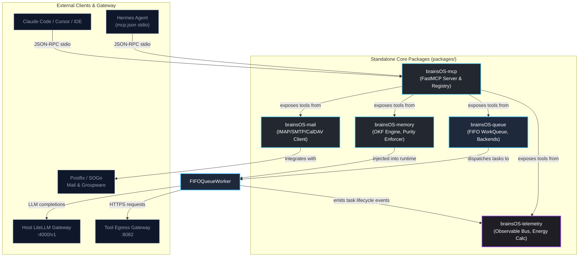

# brainsOS: Repository Navigation Map & Engagement Protocols

This document provides a comprehensive structural guide to **brainsOS** ([brainsos.ai](https://brainsos.ai)), detailing repository layout, package dependency graphs, configuration paths, and mandatory rules of engagement for human developers and autonomous AI agents.

---

## 1. Architectural Planes & Directory Map

```text
ProjectTitan/
├── .github/
│   └── workflows/              # GitHub Actions CI matrix, pre-commit, and SST deployment
├── config/                     # Declarative appliance configurations & default templates
│   ├── default_settings/       # Canonical default manifests (agents.yaml, runners.yaml, README.md)
│   ├── default_runners/        # Default runner starter templates (hermes, claude-sdk, openai-sdk)
│   ├── default_souls/          # Centralized baseline agent personas (bawtford, marvin, terrastella, ping)
│   ├── default_memories/       # Default OKF memory structure & templates (knowledge, rules, logs)
│   ├── sample_agent_app/       # Template seeds for agent application canvases (cindypawford)
│   ├── caddy/                  # L7 reverse proxy configuration (Caddyfile)
│   ├── egress/                 # Tool Egress Gateway mitmproxy configuration & addons
│   └── litellm/                # LiteLLM routing, virtual keys, and spend control
├── data/                       # Local host runtime persistence (strictly git-ignored)
│   ├── settings/               # Live fleet and runner manifest overrides (seeded on bootstrap)
│   ├── runners/                # Live runner execution scripts and configurations
│   ├── souls/                  # Live agent persona overrides (seeded on bootstrap)
│   ├── agent_apps/             # Isolated application tenants and agent deployment workspaces
│   │   └── cindypawford/       # Active Cindy Pawford tenant workspace
│   │       ├── site/           # Untrusted agent-authored web application (HTML/CSS/JS)
│   │       └── pipeline/       # Host-executed deployment infrastructure (SST Ion, AWS SDKs)
│   ├── agent_memories/         # Pure OKF Markdown partitions (<tenant_id>/knowledge, rules)
│   ├── agent_workspaces/       # Isolated execution sandboxes (<tenant_id>/scratch, tools)
│   └── agent_logs/             # Execution and telemetry logbooks
├── docker/                     # Container images and runtime sandboxes
│   └── hermes/                 # Sandboxed agent runtime image (PUID/PGID 1000)
├── docs/                       # Project documentation, architecture specs, and walkthroughs
├── packages/                   # Standalone, reusable Python domain libraries
│   ├── brainsOS-mail/          # Decoupled agent SMTP/IMAP & CalDAV groupware client
│   ├── brainsOS-mcp/           # Dynamic brainsOS MCP Server exposing tools across packages
│   ├── brainsOS-memory/        # L5 OKF memory engine, purity enforcer & vector SPI
│   ├── brainsOS-queue/         # Asynchronous FIFO task queue, SQLite/Memory backends & worker
│   └── brainsOS-telemetry/     # Decoupled Observer/Observable bus & SyntheticEnergyObserver
├── scripts/                    # Idempotent operational shell scripts (domain-separated)
│   ├── setup/                  # Host, container, memory, and network provisioning
│   ├── control/                # Lifecycle (bootstrap-env, sync-agents, emergency-stop, backup)
│   ├── verify/                 # Automated validation suites and test harnesses
│   └── apps/                   # Application deployment, preview servers, and rollback scripts
├── .env.example                # Canonical environment template (secrets never committed)
├── docker-compose.yml          # Core appliance cluster orchestration
├── docker-compose.agents.yml   # Generated fleet compose file (managed by sync-agents.sh)
├── Makefile                    # Standardized lifecycle commands (setup, up, down, test, lint)
├── pyproject.toml              # Centralized Python tooling configuration (ruff, mypy, pytest)
├── AGENTS.md                   # Agent operating discipline & development protocols
└── SECURITY.md                 # Public security policy & threat disclosure
```

---

## 2. Python Package Ecosystem & Dependency Graph



### Package Summaries
1. **`brainsOS-memory`**: High-performance Open Knowledge Format (OKF) storage parser and purity validator. Rejects non-Markdown files (`.db`, `.py`, `.bin`) from the `/memories` mount and indexes active rules and working memory.
2. **`brainsOS-queue`**: Asynchronous task queue supporting both in-memory and SQLite-backed persistence with concurrency control, task prioritization, retry mechanisms, and telemetry event hooks.
3. **`brainsOS-telemetry`**: Decoupled Observer/Observable architecture for distributed telemetry. Computes synthetic energy expenditure based on task duration and token consumption down to the millijoule ($mJ = ms \times 25.0 + tokens \times 80.0$).
4. **`brainsOS-mail`**: Comprehensive email and calendar client for agent-human interaction, parsing multipart messages, attachments, and CalDAV scheduling events.
5. **`brainsOS-mcp`**: Dynamic Model Context Protocol (FastMCP) server exposing tools and capabilities across all brainsOS packages (`memory`, `queue`, `mail`, `telemetry`) via stdio with zero native Hermes tool injection and lean schema footprints (< 800 tokens).

---

## 3. Rules of Engagement for External Agents & Contributors

Any autonomous agent or human developer working within this repository must adhere to the following mandatory protocols:

### Non-Negotiable Guardrails
1. **Memory Plane Purity (Rule 1)**: `/memories` is reserved strictly for human-auditable flat Markdown files. Never write databases, caches, or binaries to `/memories`.
2. **Inference Boundary (Rule 2)**: Agent containers must never connect directly to Ollama (`127.0.0.1:11434`). All completions route strictly through the LiteLLM gateway (`http://litellm:4000/v1`).
3. **Container Sandboxing (Rule 4)**: Agent containers run unprivileged (`PUID=1000`, `PGID=1000`), drop all capabilities (`cap_drop: [ALL]`), enforce read-only filesystems, and never mount `/var/run/docker.sock`.
4. **Secret Protection (Rule 5 & Rule 10)**: Never commit secrets. Agent containers hold zero ambient credentials; tool egress credentials (GitHub tokens) are injected in-transit by `brainsos-net-egress-proxy`.
5. **Database Isolation (Rule 6)**: The PostgreSQL control database is isolated from agent networks and accessible only to LiteLLM on host loopback.
6. **Separation of Build & Record (Rule 11)**: `docs/lab-work/` is the documentation working area owned exclusively by Claude. Coding agents must **never** read it for requirements, modify it, or include it in tickets.

### Operational Discipline
- **Script-First Validation**: Use repository scripts (`make test`, `make lint`, `./scripts/verify/*.sh`) rather than ad-hoc terminal overrides.
- **Declarative Manifest Authority**: Never edit `docker-compose.agents.yml` directly; update `config/agents.yaml` and run `./scripts/control/sync-agents.sh`.
- **Pre-Commit Review Gate**: Never commit or push without user sign-off on the generated walkthrough document (`docs/YYYY-MM-DD-ticket<issue_number>.md`).
