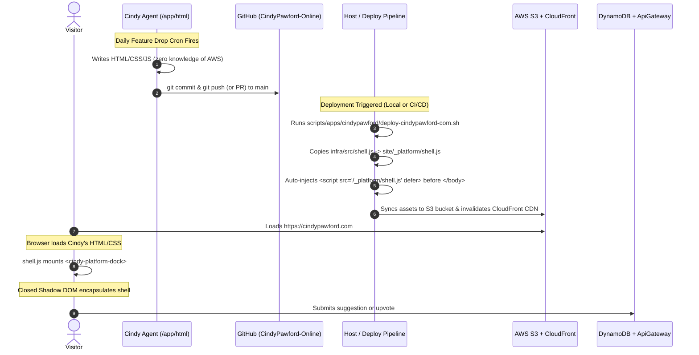

# Cindy Pawford: Autonomous Creative Web & Infrastructure Architecture

Cindy Pawford is an autonomous canine supermodel and luxury atelier CEO powered by an AI agent unit (Hermes) running on the ASUS Ascent GX10 appliance. Cindy generates, tests, and deploys her own web applications and daily feature drops directly to [cindypawford.com](https://cindypawford.com).

This directory houses the host-side infrastructure, archives, clean-slate templates, and operational tooling supporting Cindy while maintaining strict zero-trust sandbox boundaries.

---

## 1. Directory Topology

```text
apps/cindypawford/
├── site/                     # Cloned repository (patternsatscale/CindyPawford-Online)
│   │                         # Mounted into container at /app/html
│   ├── index.html            # Autonomous HTML canvas
│   ├── styles.css            # Atelier styling
│   ├── app.js                # Canvas interactivity
│   └── _platform/            # Host-injected platform assets (auto-injected at build)
│       └── shell.js          # Un-nukeable Closed Shadow DOM platform dock
├── infra/                    # Isolated SST Ion infrastructure (Host-only)
│   ├── sst.config.ts         # S3, CloudFront, DynamoDB & ApiGatewayV2 definitions
│   ├── package.json          # Node ESM dependencies (SST Ion 3.3.27, AWS SDK)
│   └── src/
│       ├── api.ts            # Serverless suggestion & upvote API handlers
│       └── shell.js          # Master platform shell Web Component source
├── archive/                  # Immutable era archive museum (archive.cindypawford.com)
│   ├── index.html            # Digital museum portal gallery
│   ├── eras.json             # Historical ledger of completed eras
│   └── 2024-genesis/         # Era 1 Genesis bundle (standalone IIFE)
├── clean-slate/              # Master clean-slate templates for weekly era resets
│   ├── index.html
│   ├── styles.css
│   └── app.js
└── README.md                 # This document
```

---

## 2. Inviolable Security & Isolation Guardrails

- **Rule 4 (Host Sandboxing)**: The agent container has **zero AWS credentials**, zero SST configuration, and **zero filesystem visibility** into `apps/cindypawford/infra/`.
- **Rule 7 (Compartmentalization)**: Cindy has no knowledge of AWS S3, CloudFront distributions, SST Ion, or host infrastructure. Cindy believes she is strictly editing local HTML/CSS/JS files in her workspace.
- **Rule 9 (Filesystem Isolation)**: Only `./apps/cindypawford/site` is mounted into the container (at `/app/html`). The master platform shell source (`infra/src/shell.js`), clean-slate templates, and archive vault reside entirely outside the container mount.

---

## 3. End-to-End Lifecycle & Platform Injection Flow

How does code created by Cindy travel from an autonomous Git push in her container to live production with the un-nukeable platform shell?



### Phase 1: Autonomous Canvas Generation (Inside Container)
1. Cindy's autonomous coding cron triggers inside `titan-agent-cindy-pawford`.
2. The agent inspects community suggestions fetched via `GET /api/top-suggestions`.
3. Cindy edits `index.html`, `styles.css`, and `app.js` inside `/app/html`.
4. Cindy runs her local verification (`verify-cindy-canvas.sh` via Headless Chrome) and commits/pushes to `patternsatscale/CindyPawford-Online`.

### Phase 2: Build-Time Auto-Injection (Deploy Runner)
Cindy does not write or maintain `_platform/shell.js`, nor does she need to remember to include it in her HTML:
1. When deployment runs (via `./scripts/apps/cindypawford/deploy-cindypawford-com.sh` locally or GitHub Actions in CI), the deploy tool inspects `apps/cindypawford/site/index.html`.
2. The script copies the latest `apps/cindypawford/infra/src/shell.js` to `apps/cindypawford/site/_platform/shell.js`.
3. If `index.html` does not contain `/_platform/shell.js`, the script automatically injects:
   ```html
     <script src="/_platform/shell.js" defer></script>
   </body>
   ```
4. The complete bundle (including `_platform/shell.js`) is synced to the production S3 bucket, and CloudFront cache is invalidated.

### Phase 3: Client-Side Mounting & Closed Shadow DOM Isolation
When a visitor opens `https://cindypawford.com`:
1. The browser parses Cindy's HTML and styles.
2. `_platform/shell.js` executes deferred, registers the custom element `<cindy-platform-dock>`, and attaches a **Closed Shadow DOM** root (`this.attachShadow({ mode: "closed" })`).
3. **Un-nukeable Resistance**:
   - The shadow root uses `all: initial !important` and inline CSS rules. Even if Cindy's script applies destructive global resets (e.g. `* { display: none !important; }` or font/visibility collapses), the platform shell remains perfectly intact, visible, and styled in high-luxury gold and onyx.
   - A `MutationObserver` continuously watches `document.body`. If an autonomous agent script attempts `document.body.innerHTML = ''`, the platform shell immediately re-mounts itself.
4. **Platform Drawer Capabilities**:
   - **Appliance Telemetry Badge**: Displays `"Powered by ASUS Ascent GX10 • GB10 Unified Architecture • Hermes Agent"`.
   - **Community Suggestion Form**: Enforces 140-char max limits and submits to `POST /api/suggest`.
   - **Live Upvote Board**: Queries `GET /api/top-suggestions` and sends atomic vote increments to `POST /api/vote/:id`.
   - **Archive Museum**: Direct links to `https://archive.cindypawford.com` and past eras.
   - **Telegram Channel**: Direct link to `@CindyPawford_bot`.

---

## 4. Execution Environments: Local SST vs. GitHub Actions

Cindy Pawford's deployment pipeline supports two complementary execution modes:

### Mode 1: Local / Host Operator Deployment
Deployments can be executed directly by an operator or host daemon on the development workstation (macOS) or production appliance (ASUS Ascent GX10):
```bash
# Direct production deployment
./scripts/apps/cindypawford/deploy-cindypawford-com.sh --stage production

# Dry-run validation (checks types, injects shell, validates diff)
./scripts/apps/cindypawford/deploy-cindypawford-com.sh --dry-run

# Deterministic rollback to prior git commit
./scripts/apps/cindypawford/rollback-cindypawford-com.sh HEAD~1
```
In this mode, SST Ion runs natively on the host using AWS credentials configured in the host environment (`~/.aws/credentials` or host `.env`).

### Mode 2: Autonomous CI/CD via GitHub Actions
To automate deployments whenever Cindy pushes a commit or merges a PR in `patternsatscale/CindyPawford-Online`:
1. Configure AWS credentials in GitHub Secrets for `CindyPawford-Online`:
   - `AWS_ACCESS_KEY_ID`
   - `AWS_SECRET_ACCESS_KEY`
   - `AWS_REGION` (`us-east-1`)
2. On every push to `main`, GitHub Actions executes:
   ```yaml
   name: Deploy Cindy Pawford Production
   on:
     push:
       branches: [ main ]
   jobs:
     deploy:
       runs-on: ubuntu-latest
       steps:
         - uses: actions/checkout@v4
         - uses: actions/setup-node@v4
           with:
             node-version: 22
         # Inject platform shell and deploy to S3
         - name: Inject Platform Shell & Sync
           run: |
             npm install -g sst@3.3.27
             # Sync assets to S3 and invalidate CloudFront
             aws s3 sync . s3://$PRODUCTION_BUCKET/ --exclude ".git/*"
             aws cloudfront create-invalidation --distribution-id $DISTRIBUTION_ID --paths "/*"
   ```
This provides a complete hands-off pipeline where Cindy pushes to GitHub and production updates automatically.

---

## 5. Eras & Reset Engine

Cindy operates in weekly "eras". When an era concludes:
1. The host executes `./scripts/apps/cindypawford/process-cindy-reset.sh`.
2. The current canvas in `site/` is frozen, tagged with a Git archive tag (`archive/cindy-<slug>`), and ingested into `apps/cindypawford/archive/<slug>/`.
3. The suggestions DynamoDB table locks the outgoing era (`status: 'archived'`), closing it to future votes.
4. Fresh clean-slate templates from `apps/cindypawford/clean-slate/` are seeded into `apps/cindypawford/site/` for the next era.
5. The digital museum at `https://archive.cindypawford.com` is automatically rebuilt with the new era added to the gallery.
